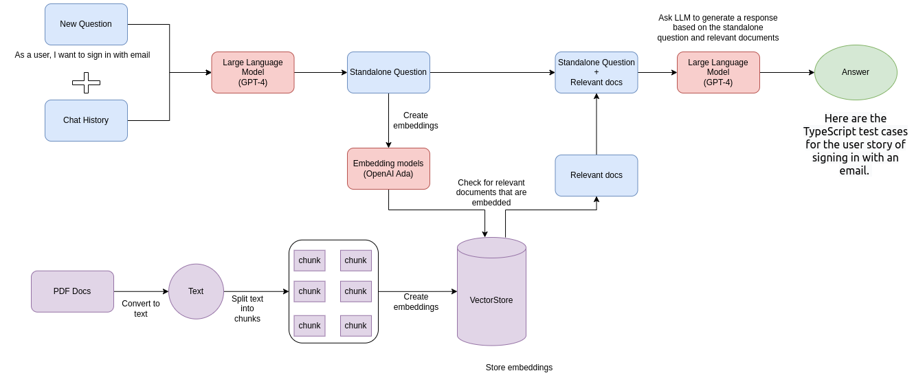

# Q&A Chatbot with Your PDF Files on Local

Use the OpenAI's API to build a Q&A Chatbot for multiple Large PDF files.

Tech stack used includes LangChain, Pinecone, Typescript, Openai, and Next.js. LangChain is a framework that makes it easier to build scalable AI/LLM apps and chatbots. Pinecone is a vectorstore for storing embeddings and your PDF in text to later retrieve similar docs.

<!--  -->


**If you run into errors, please review the troubleshooting section further down this page.**

Prelude: Please make sure you have already downloaded node on your system and the version is 18 or greater.

## Development

1. Clone the repo or download the ZIP

```
git clone [github https url]
```

2. Install packages

First run `npm install yarn -g` to install yarn globally (if you haven't already).

Then run:

```
yarn install
```

After installation, you should now see a `node_modules` folder.

3. Set up your `.env` file

- Copy `.env.example` into `.env`
  Your `.env` file should look like this:

```
OPENAI_API_KEY=
OPENAI_MODEL_NAME=

PINECONE_API_KEY=
PINECONE_ENVIRONMENT=

PINECONE_INDEX_NAME=
PINECONE_NAME_SPACE=
```

- Visit [openai](https://help.openai.com/en/articles/4936850-where-do-i-find-my-secret-api-key) to retrieve API keys and insert into your `.env` file.
- Visit [pinecone](https://pinecone.io/) to create and retrieve your API keys, and also retrieve your environment and index name from the dashboard.
- The PINECONE_NAME_SPACE is to store your embeddings on Pinecone when you run `npm run ingest`. This namespace will later be used for queries and retrieval.

4. In `utils/makechain.ts` chain change the `QA_PROMPT` for your own usecase.

## Convert your PDF files to embeddings

**This repo can load multiple PDF files**

1. Inside `docs` folder, add your pdf files or folders that contain pdf files.

2. Run the script `yarn run ingest` to 'ingest' and embed your docs. If you run into errors troubleshoot below.

3. Check Pinecone dashboard to verify your namespace and vectors have been added.

## Run the app

Once you've verified that the embeddings and content have been successfully added to your Pinecone, you can run the app `npm run dev` to launch the local dev environment, and then type a question in the chat interface.

## Troubleshooting

In general, keep an eye out in the `issues` and `discussions` section of this repo for solutions.

**General errors**

- Make sure you're running the latest Node version. Run `node -v`
- Try a different PDF or convert your PDF to text first. It's possible your PDF is corrupted, scanned, or requires OCR to convert to text.
- `Console.log` the `env` variables and make sure they are exposed.
- Make sure you're using the same versions of LangChain and Pinecone as this repo.
- Check that you've created an `.env` file that contains your valid (and working) API keys, environment and index name.
- If you change `modelName` in `OpenAI`, make sure you have access to the api for the appropriate model.
- Make sure you have enough OpenAI credits and a valid card on your billings account.
- Check that you don't have multiple OPENAPI keys in your global environment. If you do, the local `env` file from the project will be overwritten by systems `env` variable.
- Try to hard code your API keys into the `process.env` variables if there are still issues.

**Pinecone errors**

- Make sure your pinecone dashboard `environment` and `index` matches the one in the `pinecone.ts` and `.env` files.
- Check that you've set the vector dimensions to `1536`.
- Make sure your pinecone namespace is in lowercase.
- Pinecone indexes of users on the Starter(free) plan are deleted after 7 days of inactivity. To prevent this, send an API request to Pinecone to reset the counter before 7 days.
- Retry from scratch with a new Pinecone project, index, and cloned repo.
